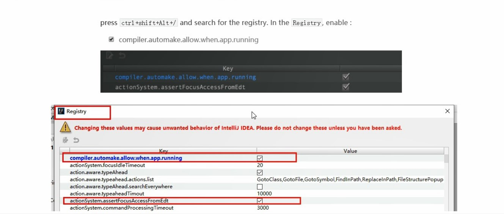

# SpringCloud（2020新版）Hoxton版 + SpringCloud alibaba
# 简介

教程重点讲解了SpringCloud各种组件停止更新进入维护阶段后，后续技术组件的升级和替换策略及方案选型，既有传统Eureka、Ribbon、OpenFeign、Hystrix、Config等技术的升级讲解，又有Consul、Gateway、Bus、Stream、Sleuth、zipkin和阿里巴巴最新的Nacos、Sentinel、Seata等技术，分享了服务降级、服务熔断、服务限流、hotkey控制、分布式统一配置管理、分布式全局事务控制、RabbitMQ与Stream整合、Nacos和Nginx配置高可用集群等技术，干货满满！


# 一、微服务架构零基础理论入门（小白必看）

## 1、微服务概述

微服务：强调的是服务的大小，它关注的是某一个点，是具体解决某一个问题/提供落地对应服务的一个服务应用,狭意的看,可以看作Eclipse里面的一个个微服务工程/或者Module。

微服务架构：是⼀种架构模式或者说是一种架构风格，它提倡将单⼀应⽤程序划分成⼀组⼩的服务，每个服务运行在其独立的自己的进程中，服务之间互相协调、互相配合，为⽤户提供最终价值。服务间采⽤轻量级的通信机制互相协作（通常是基于HTTP协议的RESTful API）。每个服务都围绕着具体业务进⾏构建，并且能够被独⽴的部署到⽣产环境、类⽣产环境等。另外，应当尽量避免统⼀的、集中式的服务管理机制，对具体的⼀个服务⽽⾔，应根据业务上下⽂，选择合适的语⾔、⼯具对其进⾏构建。可以有一个非常轻量级的集中式管理来协调这些服务，可以使用不同的语言来编写服务，也可以使用不同的数据存储。

技术维度理解：微服务化的核心就是将传统的一站式应用，根据业务拆分成一个一个的服务，彻底地去耦合,每一个微服务提供单个业务功能的服务，一个服务做一件事，从技术角度看就是一种小而独立的处理过程，类似进程概念，能够自行单独启动或销毁，拥有自己独立的数据库。

微服务优缺点

优点：

-    每个服务足够内聚，足够小，代码容易理解这样能聚焦一个指定的业务功能或业务需求；
-   开发简单、开发效率提高，一个服务可能就是专一的只干一件事；
-   微服务能够被小团队单独开发，这个小团队是2到5人的开发人员组成；
-   微服务是松耦合的，是有功能意义的服务，无论是在开发阶段或部署阶段都是独立的；
-   微服务能使用不同的语言开发；
-   易于和第三方集成，微服务允许容易且灵活的方式集成自动部署，通过持续集成工具，如Jenkins,Hudson,bamboo；
-   微服务易于被一个开发人员理解，修改和维护，这样小团队能够更关注自己的工资成果。无需通过合作才能体现价值；
-   微服务允许你利用融合最新技术；
-   微服务只是业务逻辑的代码，不会和HTML,CSS或其他界面组件混合；
-   每个微服务都有自己的存储能力，可以有自己的数据库。也可以有统一的数据库。

缺点：

-   开发人员要处理分布式系统的复杂性；
-   多服务运维难度，随着服务的增加，运维的压力也在增大；
-   系统部署依赖；
-   服务间通信成本；
-   数据一致性；
-   系统集成测试；
-   性能监控。

微服务技术栈： 多种技术的集合体。


## 2、SpringCloud入门


为什么选择SpringCloud作为微服务架构？选型依据：

- ​    整体解决方案和框架成熟度
- ​    社区热度
- ​    可维护性
- ​    学习曲线

SpringCloud：基于SpringBoot提供了一套微服务解决方案，包括服务注册与发现，配置中心，全链路监控，服务网关，负载均衡，熔断器等组件，除了基于NetFlix的开源组件做高度抽象封装之外，还有一些选型中立的开源组件。分布式微服务架构下的一站式解决方案，是各个微服务架构落地技术的集合体，俗称微服务全家桶。SpringCloud利用SpringBoot的开发便利性巧妙地简化了分布式系统基础设施的开发，SpringCloud为开发人员提供了快速构建分布式系统的一些工具，包括配置管理、服务发现、断路器、路由、微代理、事件总线、全局锁、决策竞选、分布式会话等等,它们都可以用SpringBoot的开发风格做到一键启动和部署。

 

SpringBoot并没有重复制造轮子，它只是将目前各家公司开发的比较成熟、经得起实际考验的服务框架组合起来，通过SpringBoot风格进行再封装屏蔽掉了复杂的配置和实现原理，最终给开发者留出了一套简单易懂、易部署和易维护的分布式系统开发工具包。

SpringCloud和SpringBoot是什么关系：

- SpringBoot专注于快速方便的开发单个个体微服务。SpringCloud是关注全局的微服务协调整理治理框架，它将SpringBoot开发的一个个单体微服务整合并管理起来，为各个微服务之间提供，配置管理、服务发现、断路器、路由、微代理、事件总线、全局锁、决策竞选、分布式会话等等集成服务

-  SpringBoot可以离开SpringCloud独立使用开发项目，但是SpringCloud离不开SpringBoot，属于依赖的关系。
-  SpringBoot专注于快速、方便的开发单个微服务个体，SpringCloud关注全局的服务治理框架。

互联网大厂微服务架构案例：


# 二、从SpringBoot 2.2.x和SpringCloud H版本开始说起

## 1、版本选择

通过SpringBoot和SpringCloud官网，可以看到当前的最新稳定版本。但不是最新的版本就是最好的，SpringBoot和SpringCloud存在版本依赖。

SpringBoot官网：[https://spring.io/projects/spring-boot](https://spring.io/projects/spring-boot#learn)

SpringCloud官网：https://spring.io/projects/spring-cloud

SpringCloud中文文档：https://www.bookstack.cn/read/spring-cloud-docs/docs-index.md

版本依赖可以查看SpringCloud官网：https://spring.io/projects/spring-cloud#overview


还可以通过：https://start.spring.io/actuator/info查看对应的版本依赖关系


## 2、当前项目选择的最终版本


# 三、关于Cloud各种组件的停更/升级/替换

之前SpringCloud各个组件选型如下：


在Netflix对各个组件采取停更不停用的措施后，SpringCloud家族出现了很多种可以替代的新组件，如下：


# 四、微服务架构编码构建

约定 > 配置 > 编码

## 1、IDEA新建Project工作空间

### （1）微服务cloud整体聚合父工程Project

#### ① 新建空的Maven项目即可，不勾选Create from archetype

                                              

#### ② 聚合总父工程名字

 

```
     <groupId>com.atguigu.springcloud</groupId>
     <artifactId>cloud2020</artifactId>
```

#### ③ Maven选版本3.5及以上


#### ④ 字符编码设为UTF-8


#### ⑤ 注解生效激活


#### ⑥ java编译版本选8


#### ⑦ File Type过滤*.idea和*.iml


### （2）父工程pom文件

```xml
<?xml version="1.0" encoding="UTF-8"?>
<project xmlns="http://maven.apache.org/POM/4.0.0"
         xmlns:xsi="http://www.w3.org/2001/XMLSchema-instance"
         xsi:schemaLocation="http://maven.apache.org/POM/4.0.0 http://maven.apache.org/xsd/maven-4.0.0.xsd">
    <modelVersion>4.0.0</modelVersion>
    <groupId>com.atguigu.springcloud</groupId>
    <artifactId>cloud2020</artifactId>
    <version>1.0-SNAPSHOT</version>
    <packaging>pom</packaging>
    <!-- 统一管理Jar包版本 -->
    <properties>
        <project.build.sourceEncoding>UTF-8</project.build.sourceEncoding>
        <maven.compiler.source>1.8</maven.compiler.source>
        <maven.compiler.target>1.8</maven.compiler.target>
        <junit.version>4.12</junit.version>
        <log4j.version>1.2.17</log4j.version>
        <lombok.version>1.16.18</lombok.version>
        <mysql.version>5.1.47</mysql.version>
        <druid.version>1.1.16</druid.version>
        <mybatis.spring.boot.version>1.3.0</mybatis.spring.boot.version>
    </properties>
    <!-- 子模块继承之后，提供作用：锁定版本+子Module不用谢groupId和version -->
    <dependencyManagement>
        <dependencies>
            <dependency>
                <groupId>org.springframework.boot</groupId>
                <artifactId>spring-boot-dependencies</artifactId>
                <version>2.2.2.RELEASE</version>
                <type>pom</type>
                <scope>import</scope>
            </dependency>
            <dependency>
                <groupId>org.springframework.cloud</groupId>
                <artifactId>spring-cloud-dependencies</artifactId>
                <version>Hoxton.SR1</version>
                <type>pom</type>
                <scope>import</scope>
            </dependency>
            <dependency>
                <groupId>com.alibaba.cloud</groupId>
                <artifactId>spring-cloud-alibaba-dependencies</artifactId>
                <version>2.1.0.RELEASE</version>
                <type>pom</type>
                <scope>import</scope>
            </dependency>
            <dependency>
                <groupId>junit</groupId>
                <artifactId>junit</artifactId>
                <version>${junit.version}</version>
                <scope>test</scope>
            </dependency>
            <dependency>
                <groupId>log4j</groupId>
                <artifactId>log4j</artifactId>
                <version>${log4j.version}</version>
            </dependency>
            <dependency>
                <groupId>mysql</groupId>
                <artifactId>mysql-connector-java</artifactId>
                <version>${mysql.version}</version>
            </dependency>
            <dependency>
                <groupId>com.alibaba</groupId>
                <artifactId>druid</artifactId>
                <version>${druid.version}</version>
            </dependency>
            <dependency>
                <groupId>org.mybatis.spring.boot</groupId>
                <artifactId>mybatis-spring-boot-starter</artifactId>
                <version>${mybatis.spring.boot.version}</version>
            </dependency>
            <dependency>
                <groupId>org.projectlombok</groupId>
                <artifactId>lombok</artifactId>
                <version>${lombok.version}</version>
                <optional>true</optional>
            </dependency>
        </dependencies>
    </dependencyManagement>
    <build>
        <plugins>
            <plugin>
                <groupId>org.springframework.boot</groupId>
                <artifactId>spring-boot-maven-plugin</artifactId>
                <configuration>
                    <fork>true</fork>
                    <addResources>true</addResources>
                </configuration>
            </plugin>
        </plugins>
    </build>
</project>
```

### （3）Maven中的DependencyManagement和Dependencies

Maven使用dependencyManagement 元素来提供了一种管理依赖版本号的方式。通常会在一个组织或者项目的最顶层的父POM中看到dependencyManagement 元素。

使用pom.xm 中的dependencyManagement 元素能让所有在子项目中引用一个依赖而不用显示的列出版本号。

Maven 会沿着父子层次向上走，直到找到一个拥有dependencyManagement 元素的项目，然后它就会使用这个dependencyManagement 元素中指定的版本号。

dependencyManagement 元素中指定的版本号，例如在父项目里：

```xml
 <dependencyManagement>
        <dependencies>
             <dependency>
                <groupId>mysql</groupId>
                <artifactId>mysql-connector-java</artifactId>
                <version>5.1.47</version>
            </dependency>
        </dependencies>
</dependencyManagement>     
```

然后再子项目里就可以添加mysql-connector-java时不指定版本号，例如：

```xml
<dependencies>
    <dependency>
        <groupId>mysql</groupId>
        <artifactId>mysql-connector-java</artifactId>
        <version>5.1.47</version>
    </dependency>
</dependencies>
```

这样做的好处就是：如果有多个子项目都引用同一依赖，则可以避免在每个使用的子项目里都声明一个版本号，这样当想升级或切换到另一个版本时，只需要在顶层父容器里更新，而不需要一个一个子项目的修改；另外如果某个子项目需要另外的一个版本，只需要声明version就可。

注意：

- dependencyManagement 里只是声明依赖，并不实现引入，因此子项目需要显示的声明需要用的依赖；
- 如果不在子项目中声明依赖，是不会从父项目中继承下来的；只有在子项目中写了该依赖项，并且没有指定具体版本，才会从父项目中继承该项并且version和scope都读取自父pom；
-  如果子项目中指定了版本号，那么会使用子项目中指定 jar版本。  

### （4）Maven跳过单元测试


### （5）父工程创建完成执行mvn:install将父工程发布到仓库方便子工程继承


## 2、Rest微服务工程构建

建Module ---》改pom ---》写yml ---》主启动类 ---》业务类 

### （1）cloud-provider-payment8001微服务提供者支付Module模块

#### ① 新建空的子Module，命名为cloud-provider-payment8001

#### ② 修改cloud-provider-payment8001的pom.xml

```xml
<?xml version="1.0" encoding="UTF-8"?>
<project xmlns="http://maven.apache.org/POM/4.0.0"
         xmlns:xsi="http://www.w3.org/2001/XMLSchema-instance"
         xsi:schemaLocation="http://maven.apache.org/POM/4.0.0 http://maven.apache.org/xsd/maven-4.0.0.xsd">
    <parent>
        <artifactId>cloud2020</artifactId>
        <groupId>com.atguigu.springcloud</groupId>
        <version>1.0-SNAPSHOT</version>
    </parent>
    <modelVersion>4.0.0</modelVersion>
    <artifactId>cloud-provider-payment8001</artifactId>
    <dependencies>
        <dependency>
            <groupId>org.springframework.boot</groupId>
            <artifactId>spring-boot-starter-web</artifactId>
        </dependency>
        <dependency>
            <groupId>org.springframework.boot</groupId>
            <artifactId>spring-boot-starter-actuator</artifactId>
        </dependency>
        <dependency>
            <groupId>org.mybatis.spring.boot</groupId>
            <artifactId>mybatis-spring-boot-starter</artifactId>
        </dependency>
        <dependency>
            <groupId>com.alibaba</groupId>
            <artifactId>druid-spring-boot-starter</artifactId>
            <version>1.1.10</version>
        </dependency>
        <dependency>
            <groupId>mysql</groupId>
            <artifactId>mysql-connector-java</artifactId>
        </dependency>
        <dependency>
            <groupId>org.springframework.boot</groupId>
            <artifactId>spring-boot-starter-jdbc</artifactId>
        </dependency>
        <dependency>
            <groupId>org.springframework.boot</groupId>
            <artifactId>spring-boot-devtools</artifactId>
            <scope>runtime</scope>
            <optional>true</optional>
        </dependency>
        <dependency>
            <groupId>org.projectlombok</groupId>
            <artifactId>lombok</artifactId>
            <optional>true</optional>
        </dependency>
        <dependency>
            <groupId>org.springframework.boot</groupId>
            <artifactId>spring-boot-starter-test</artifactId>
            <scope>test</scope>
        </dependency>
    </dependencies>
</project>
```

#### ③ 新建application.yml

```yaml
server:
  port: 8001
spring:
  application:
    name: cloud-payment-service
  datasource:
    type: com.alibaba.druid.pool.DruidDataSource # 当前数据源操作类型
    driver-class-name: org.gjt.mm.mysql.Driver # mysql驱动包
    url: jdbc:mysql://localhost:3306/cloud2020?useUnicode=true&characterEncoding=utf-8&useSSL=false
    username: root
    password: 123456
mybatis:
  mapper-locations: classpath:mapper/*.xml
  type-aliases-package: com.atguigu.springcloud.entities # 所有Entity别名类所在包
```

#### ④ 新建PaymentMain8001主启动类

```java
package com.atguigu.springcloud;
import org.springframework.boot.SpringApplication;
import org.springframework.boot.autoconfigure.SpringBootApplication;
/**
 * @author 王柳
 * @date 2020/4/2 14:17
 */
@SpringBootApplication
public class PaymentMain8001 {
    public static void main(String[] args) {
        SpringApplication.run(PaymentMain8001.class, args);
    }
}
```

#### ⑤ 新建业务相关类

##### 创建表payment

```sql
CREATE TABLE `payment`(
`id` bigint(20) NOT NULL AUTO_INCREMENT COMMENT 'ID',
`serial` varchar(200) DEFAULT '',
PRIMARY KEY(`id`)
) ENGINE=INNODB AUTO_INCREMENT=1 DEFAULT CHARSET=utf8
```

##### 新建实体类Payment和通用返回结果集实体类CommonResult

```java
package com.atguigu.springcloud.entities;
import lombok.AllArgsConstructor;
import lombok.Data;
import lombok.NoArgsConstructor;
import java.io.Serializable;
/**
 * 支付表 实体类
 *
 * @author 王柳
 * @date 2020/4/2 14:29
 */
@Data
@AllArgsConstructor
@NoArgsConstructor
public class Payment implements Serializable {
    private Long id;
    private String serial;
}
```

```java
package com.atguigu.springcloud.entities;
import lombok.AllArgsConstructor;
import lombok.Data;
import lombok.NoArgsConstructor;
/**
 * 通用返回结果集
 *
 * @author 王柳
 * @date 2020/4/2 14:31
 */
@Data
@AllArgsConstructor
@NoArgsConstructor
public class CommonResult<T> {
    private Integer code;
    private String message;
    private T data;
    public CommonResult(Integer code, String message) {
        this(code, message, null);
    }
}
```

##### 新建dao和对应xml文件

```java
package com.atguigu.springcloud.dao;
import com.atguigu.springcloud.entities.Payment;
import org.apache.ibatis.annotations.Mapper;
import org.apache.ibatis.annotations.Param;
/**
 * @author 王柳
 * @date 2020/4/2 14:34
 */
@Mapper
public interface PaymentDao {
    int create(Payment payment);
    Payment getPaymentById(@Param("id") Long id);
}
```

```xml
<?xml version="1.0" encoding="UTF-8"?>
<!DOCTYPE mapper PUBLIC "-//mybatis.org//DTD Mapper 3.0//EN"
        "http://mybatis.org/dtd/mybatis-3-mapper.dtd">
<mapper namespace="com.atguigu.springcloud.dao.PaymentDao">
    <resultMap id="BaseResultMap" type="com.atguigu.springcloud.entities.Payment">
        <id column="id" property="id" jdbcType="BIGINT"/>
        <result column="serial" property="serial" jdbcType="VARCHAR"/>
    </resultMap>
    <insert id="create" parameterType="com.atguigu.springcloud.entities.Payment" useGeneratedKeys="true" keyProperty="id">
        insert into payment(serial) values(#{serial});
    </insert>
    <select id="getPaymentById" parameterType="java.lang.Long" resultMap="BaseResultMap">
        select * from payment where id=#{id}
    </select>
</mapper>
```

##### 新建service和对应实现类

```java
package com.atguigu.springcloud.service;
import com.atguigu.springcloud.entities.Payment;
import org.apache.ibatis.annotations.Param;
/**
 * @author 王柳
 * @date 2020/4/2 14:41
 */
public interface PaymentService {
    int create(Payment payment);
    Payment getPaymentById(@Param("id") Long id);
}
```

```java
package com.atguigu.springcloud.service.impl;
import com.atguigu.springcloud.dao.PaymentDao;
import com.atguigu.springcloud.entities.Payment;
import com.atguigu.springcloud.service.PaymentService;
import org.springframework.stereotype.Service;
import javax.annotation.Resource;
/**
 * @author 王柳
 * @date 2020/4/2 14:41
 */
@Service
public class PaymentServiceImpl implements PaymentService {
    @Resource
    private PaymentDao paymentDao;
    @Override
    public int create(Payment payment) {
        return paymentDao.create(payment);
    }
    @Override
    public Payment getPaymentById(Long id) {
        return paymentDao.getPaymentById(id);
    }
}
```

##### 新建controller类

```java
package com.atguigu.springcloud.controller;
import com.atguigu.springcloud.entities.CommonResult;
import com.atguigu.springcloud.entities.Payment;
import com.atguigu.springcloud.service.PaymentService;
import lombok.extern.slf4j.Slf4j;
import org.springframework.beans.factory.annotation.Autowired;
import org.springframework.web.bind.annotation.*;
/**
 * @author 王柳
 * @date 2020/4/2 14:43
 */
@RestController
@Slf4j
public class PaymentController {
    @Autowired
    private PaymentService paymentService;
    @PostMapping("/payment/create")
    public CommonResult create(@RequestBody Payment payment) {
        int result = paymentService.create(payment);
        log.info("*****插入结果：" + result);
        if (result > 0) {
            return new CommonResult(200, "插入数据库成功", result);
        } else {
            return new CommonResult(444, "插入数据库失败");
        }
    }
    @GetMapping("/payment/get/{id}")
    public CommonResult getPaymentById(@PathVariable("id") Long id) {
        Payment payment = paymentService.getPaymentById(id);
        log.info("*****查询结果：" + payment);
        if (payment != null) {
            return new CommonResult(200, "查询成功", payment);
        } else {
            return new CommonResult(444, "没有对应记录,查询ID：" + id);
        }
    }
}
```

#### ⑥ 测试


### （2）热部署Devtools

只能开发阶段使用

#### ① Adding devtools to your project


#### ② Adding plugin to your pom.xml


#### ③ Enabling automatic build


#### ④ Update the value of



#### ⑤ 重启IDEA

### （3）cloud-consumer-order80微服务消费者订单Module模块

#### ① 新建空的子Module，命名为cloud-consumer-order80

#### ② 修改cloud-consumer-order80的pom.xml

```xml
<?xml version="1.0" encoding="UTF-8"?>
<project xmlns="http://maven.apache.org/POM/4.0.0"
         xmlns:xsi="http://www.w3.org/2001/XMLSchema-instance"
         xsi:schemaLocation="http://maven.apache.org/POM/4.0.0 http://maven.apache.org/xsd/maven-4.0.0.xsd">
    <parent>
        <artifactId>cloud2020</artifactId>
        <groupId>com.atguigu.springcloud</groupId>
        <version>1.0-SNAPSHOT</version>
    </parent>
    <modelVersion>4.0.0</modelVersion>
    <artifactId>cloud-consumer-order80</artifactId>
    <dependencies>
        <dependency>
            <groupId>org.springframework.boot</groupId>
            <artifactId>spring-boot-starter-web</artifactId>
        </dependency>
        <dependency>
            <groupId>org.springframework.boot</groupId>
            <artifactId>spring-boot-starter-actuator</artifactId>
        </dependency>
        <dependency>
            <groupId>org.springframework.boot</groupId>
            <artifactId>spring-boot-devtools</artifactId>
            <scope>runtime</scope>
            <optional>true</optional>
        </dependency>
        <dependency>
            <groupId>org.projectlombok</groupId>
            <artifactId>lombok</artifactId>
            <optional>true</optional>
        </dependency>
        <dependency>
            <groupId>org.springframework.boot</groupId>
            <artifactId>spring-boot-starter-test</artifactId>
            <scope>test</scope>
        </dependency>
    </dependencies>
</project>
```

#### ③ 新建application.yml

```yaml
server:
  port: 80
```

#### ④ 新建OrderMain80主启动类

```java
package com.atguigu.springcloud;
import org.springframework.boot.SpringApplication;
import org.springframework.boot.autoconfigure.SpringBootApplication;
/**
 * @author 王柳
 * @date 2020/4/2 15:03
 */
@SpringBootApplication
public class OrderMain80 {
    public static void main(String[] args) {
        SpringApplication.run(OrderMain80.class, args);
    }
}
```

#### ⑤ 新建业务相关类

##### 新建实体类Payment和通用返回结果集实体类CommonResult

（同cloud-provider-payment8001一致）

##### 新建ApplicationContextConfig配置类

```java
package com.atguigu.springcloud.config;
import org.springframework.context.annotation.Bean;
import org.springframework.context.annotation.Configuration;
import org.springframework.web.client.RestTemplate;
/**
 * @author 王柳
 * @date 2020/4/2 15:11
 */
@Configuration
public class ApplicationContextConfig {
    @Bean
    public RestTemplate getRestTemplate() {
        return new RestTemplate();
    }
}
```

##### 新建OrderController类

```java
package com.atguigu.springcloud.controller;
import com.atguigu.springcloud.entities.CommonResult;
import com.atguigu.springcloud.entities.Payment;
import lombok.extern.slf4j.Slf4j;
import org.springframework.beans.factory.annotation.Autowired;
import org.springframework.web.bind.annotation.GetMapping;
import org.springframework.web.bind.annotation.PathVariable;
import org.springframework.web.bind.annotation.RestController;
import org.springframework.web.client.RestTemplate;
/**
 * @author 王柳
 * @date 2020/4/2 15:12
 */
@RestController
@Slf4j
public class OrderController {
    public static final String PAYMENT_URL = "http://localhost:8001";
    @Autowired
    private RestTemplate restTemplate;
    @GetMapping("/consumer/payment/create")
    public CommonResult<Payment> create(Payment payment) {
        return restTemplate.postForObject(PAYMENT_URL + "/payment/create", payment, CommonResult.class);
    }
    @GetMapping("/consumer/payment/get/{id}")
    public CommonResult<Payment> getPayment(@PathVariable("id") Long id) {
        return restTemplate.getForObject(PAYMENT_URL + "/payment/get/" + id, CommonResult.class);
    }
}
```

#### ⑥ RestTemplate

##### 是什么

​      RestTemplate提供了多种便捷访问远程Http服务的方法， 是一种简单便捷的访问restful服务模板类，是Spring提供的用于访问Rest服务的客户端模板工具集。

##### 官网及使用

​     官网地址：https://docs.spring.io/spring-framework/docs/4.3.7.RELEASE/javadoc-api/org/springframework/web/client/RestTemplate.html

​     使用：使用restTemplate访问restful接口非常的简单粗暴无脑。(url, requestMap, ResponseBean.class)这三个参数分别代表 REST请求地址、请求参数、HTTP响应转换被转换成的对象类型。


#### ⑦ 测试


### （4）工程重构

#### ① 问题：系统中有重复部分，需要重构

#### ② 新建cloud-api-commons

#### ③ 修改cloud-api-commons的pom.xml

```xml
<?xml version="1.0" encoding="UTF-8"?>
<project xmlns="http://maven.apache.org/POM/4.0.0"
         xmlns:xsi="http://www.w3.org/2001/XMLSchema-instance"
         xsi:schemaLocation="http://maven.apache.org/POM/4.0.0 http://maven.apache.org/xsd/maven-4.0.0.xsd">
    <parent>
        <artifactId>cloud2020</artifactId>
        <groupId>com.atguigu.springcloud</groupId>
        <version>1.0-SNAPSHOT</version>
    </parent>
    <modelVersion>4.0.0</modelVersion>
    <artifactId>cloud-api-commons</artifactId>
    <dependencies>
        <dependency>
            <groupId>org.springframework.boot</groupId>
            <artifactId>spring-boot-devtools</artifactId>
            <scope>runtime</scope>
            <optional>true</optional>
        </dependency>
        <dependency>
            <groupId>org.projectlombok</groupId>
            <artifactId>lombok</artifactId>
            <optional>true</optional>
        </dependency>
        <dependency>
            <groupId>cn.hutool</groupId>
            <artifactId>hutool-all</artifactId>
            <version>5.1.0</version>
        </dependency>
    </dependencies>
</project>
```

#### ④ 新建entities

将订单80和支付8001中的实体类Payment和CommonResult移到该模块

#### ⑤ maven命令 clean install

#### ⑥ 订单80和支付8001分别改造

将订单80和支付8001中的entities包删除，pom文件引入cloud-api-commons

```xml
        <dependency>
            <groupId>com.atguigu.springcloud</groupId>
            <artifactId>cloud-api-commons</artifactId>
            <version>${project.version}</version>
        </dependency>
```


# 五、Eureka服务注册与发现

# 六、Zookeeper服务注册与发现

# 七、Consul服务注册与发现

# 八、Ribbon负载均衡服务调用

# 九、OpenFeign服务接口调用

# 十、Hystrix断路器

# 十一、Zuul路由网关

# 十二、Gateway新一代网关

# 十三、SpringCloud Config分布式配置中心

# 十四、SpringCloud Bus 消息总线

# 十五、SpringCloud Stream 消息驱动

# 十六、SpringCloud Sleuth分布式请求链路跟踪

# 十七、SpringCloud Alibaba入门简介

# 十八、SpringCloud Alibaba Nacos服务注册和配置中心

# 十九、SpringCloud Alibaba Sentinel实现熔断与限流

# 二十、SpringCloud Alibaba Seata处理分布式事务