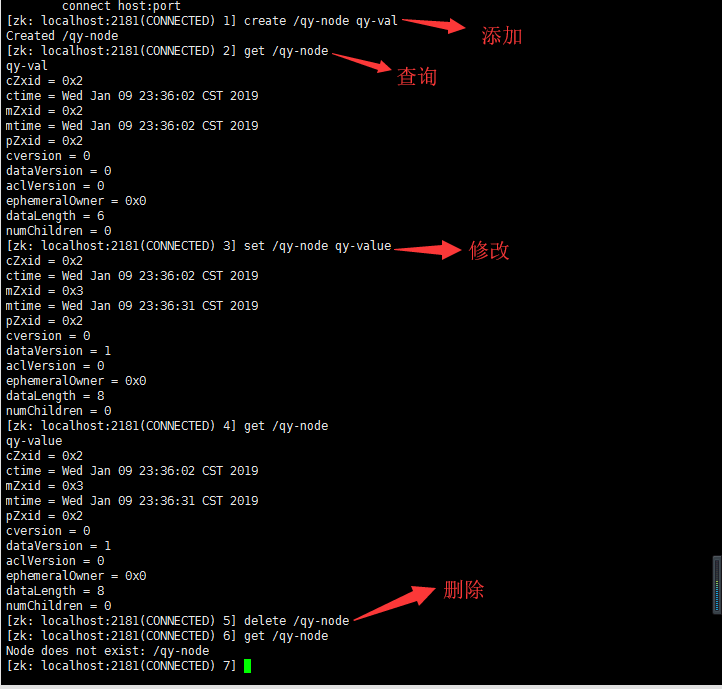
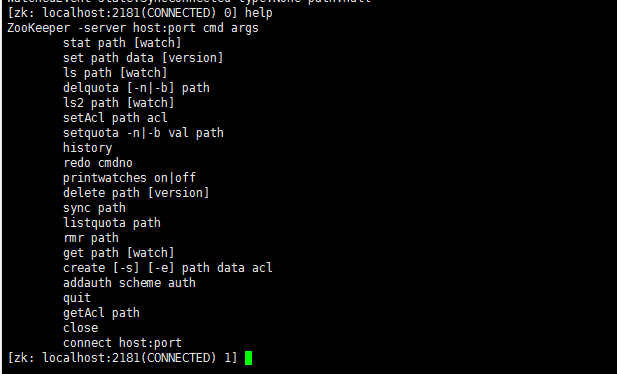
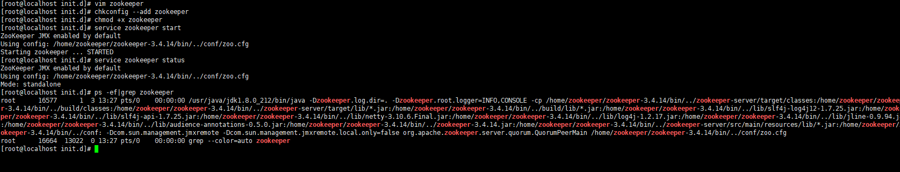

centos7上安装zookeeper

# 一、准备压缩包

选择对应的Zookeeper安装包，这里我选择的是zookeeper-3.4.14。

下载地址：http://mirror.bit.edu.cn/apache/zookeeper/

# 二、安装Zookeeper

将压缩包通过WinScp上传至/home/zookeeper文件下，使用tar命令解压压缩包

```shell
tar -zxvf zookeeper-3.4.14.tar.gz
```

进入 conf 文件夹下，将 zoo_sample.cfg 复制一份并命名为 zoo.cfg

```shell
cd /home/zookeeper/zookeeper-3.4.14/conf
cp zoo_sample.cfg zoo.cfg
```

创建数据存储目录与日志目录，简单修改zoo.cfg的配置

```shell
mkdir /home/zookeeper/dataDir
mkdir /home/zookeeper/dataLogDir
vim /home/zookeeper/zookeeper-3.4.14/conf/zoo.cfg
```

```shell
dataDir=/home/zookeeper/dataDir
dataLogDir=/home/zookeeper/dataLogDir
```

配置zookeeper环境变量

```shell
vim /etc/profile
```

```shell
export ZOOKEEPER_HOME=/home/zookeeper/zookeeper-3.4.14
export PATH=$PATH:$ZOOKEEPER_HOME/bin
```

使环境变量生效：

```shell
source /etc/profile
```

# 三、测试使用

1）启动

```shell
/home/zookeeper/zookeeper-3.4.14/bin/zkServer.sh start
```

查询 zookeeper 状态

```shell
/home/zookeeper/zookeeper-3.4.14/bin/zkServer.sh status
```

关闭 zookeeper 服务

```shell
/home/zookeeper/zookeeper-3.4.14/bin/zkServer.sh stop
```

2）连接

```shell
/home/zookeeper/zookeeper-3.4.14/bin/zkCli.sh
```

3）增删改查

　　　　

4）其他

help查看指令帮助

　　　　

# 四、设置开机自启

进入 /etc/init.d 目录

创建文件zookeeper，并添加脚本

```shell
vim zookeeper
```

```shell
#!/bin/bash
#chkconfig:2345 20 90
#description:zookeeper
#processname:zookeeper
ZK_PATH=/home/zookeeper/zookeeper-3.4.14
export JAVA_HOME=/usr/java/jdk1.8.0_212
case $1 in
         start) sh  $ZK_PATH/bin/zkServer.sh start;;
         stop)  sh  $ZK_PATH/bin/zkServer.sh stop;;
         status) sh  $ZK_PATH/bin/zkServer.sh status;;
         restart) sh $ZK_PATH/bin/zkServer.sh restart;;
         *)  echo "require start|stop|status|restart"  ;;
esac
```

保存脚本之后，执行以下指令将其注册为服务：

```shell
chkconfig --add zookeeper
```

修改创建的zookeeper服务权限

```shell
chmod +x zookeeper
```



# 五、开启防火墙端口

 

```shell
firewall-cmd --zone=public --add-port=2181/tcp --permanent #开放2181端口
```

重启防火墙

```shell
firewall-cmd --reload # 开启或关闭端口需要重启，重启后配置立即生效
```

查看开放的端口号

```shell
firewall-cmd --list-all #查看所有
firewall-cmd --list-ports #查看所有开放的端口
```